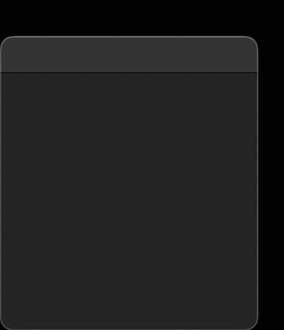
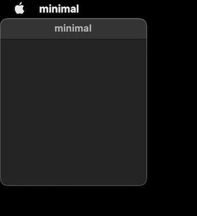

## A Minimal Swift Window Script

---

| _A tiny script that makes a window on MacOS :)_ |
| ---- |

---

## How to run

``` bash
# --- to run: ----
./minimal       # for the spartan version
./minimal_large # for the nice version
# --- to compile: ----
make
# it's just wrapping `swiftc minimal.swift -o minimal`
```

## Backstory

Heavily inspired by [little-fbdev-critcl-play](https://github.com/osnr/little-fbdev-critcl-play) I was curious to know if you can draw pixels directly to the MacOS "framebuffer" (short answer: no, there's no `/dev/fb0` on MacOS, long answer: maybe you can make a file that auto-writes to Quartz Display Services or something??? That's for another time though.) Frustrated with all of that I went down a different rabbit hole: can I, in a small script, make a MacOS window? Without Xcode, without Tk, or SDL ...

I stumbled on [this great StackOverflow question](https://stackoverflow.com/questions/30763229/display-window-on-osx-using-swift-without-xcode-or-nib) & got the bones of `minimal.swift`.

So I copy/pasted that answer into a Swift file on my latop, ran the compile command & got a
bunch of errors.

As that StackOverflow question is from 2015, the answer from 2017 (Swift 3), and I'm now writing in 2023 (using Swift 5.7), some
things have broken. [This comment gets us most of the way there:](https://stackoverflow.com/questions/30763229/display-window-on-osx-using-swift-without-xcode-or-nib#comment105128857_46348417)
> I am running Swift 5 and I had to change a couple of things, but it works.

The changes:
| **Swift 3** | **Swift 4** |
| ------------|-------------|
| `NSApplication.shared()` | `NSApplication.shared` |
| `NSApplicationActivationPolicy` | `NSApplication.ActivationPolicy` |
| `NSTitledWindowMask` | `.titled` |

But I ran into one more thing ...

``` bash
minimal.swift:18:31: error: 'NSBackingStoreType' has been renamed to 'NSWindow.BackingStoreType'
    styleMask:.titled,backing:NSBackingStoreType.buffered,defer:false)
                              ^~~~~~~~~~~~~~~~~~
                              NSWindow.BackingStoreType
AppKit.NSBackingStoreType:2:18: note: 'NSBackingStoreType' was obsoleted in Swift 4
public typealias NSBackingStoreType = NSWindow.BackingStoreType
                 ^
make: *** [Makefile:2: start] Error 1
```

Okay, so we change `NSBackingStoreType` to `NSWindow` & ...



_**it works!**_

This made me think ... is this _**the most minimal**_? How
much of this can we remove? Turns out, most of it! Granted, we are throwing away
the ability to `[⌘ + Q]` quit & the app title, but those are just niceties lol

``` swift
// The smolest Swift script to make a window in Swift 5.7.2:
import Cocoa
let nsapp = NSApplication.shared
NSApp.setActivationPolicy(NSApplication.ActivationPolicy.regular)
let window = NSWindow.init(contentRect:NSMakeRect(0, 0, 200, 200), styleMask:.titled,backing:NSWindow.BackingStoreType.buffered,defer:false)
window.makeKeyAndOrderFront(nil)
NSApp.activate(ignoringOtherApps:true)
NSApp.run()
```

